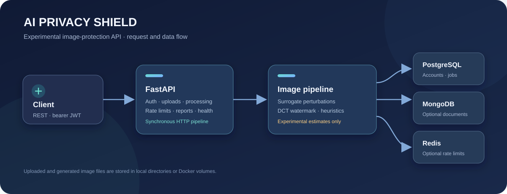
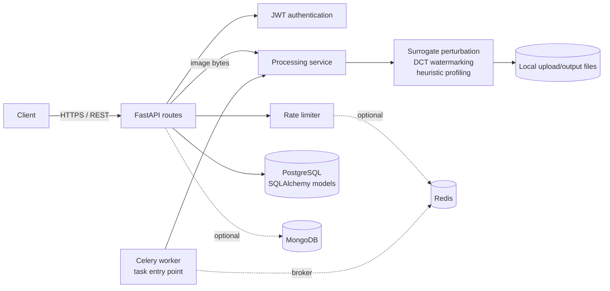

<div align="center">

# AI Privacy Shield

### An experimental FastAPI service for image privacy transformations and protection research.

[](https://www.python.org/)
[](https://fastapi.tiangolo.com/)
[](https://www.docker.com/)
[](https://github.com/lokesh10042005/project/actions/workflows/ci.yml)
[](LICENSE)
[](https://github.com/lokesh10042005/project)



</div>

> **Research prototype:** the image transforms and privacy metrics are heuristic/simulated. They have not been validated against commercial face-recognition, deepfake, or scraping systems and must not be treated as a guarantee of protection.

AI Privacy Shield provides an authenticated API for uploading images, applying configurable pixel-level transformations, and reviewing the resulting image and heuristic quality metrics. It brings image handling, authentication, rate limiting, and optional data services into one small Python project.

## What it includes

- **Image API:** authenticated upload, synchronous processing, status, download, and deletion routes.
- **Experimental transforms:** surrogate-gradient FGSM/PGD-style perturbations, frequency-domain perturbations, and a DCT-based ownership watermark.
- **Metadata handling:** uploaded images are converted to RGB and re-encoded after EXIF data is discarded.
- **Heuristic analysis:** image statistics estimate face-like regions and attributes; these are not model inference or identity-recognition results.
- **Account security:** bcrypt password hashing, access/refresh JWTs, role helpers, and endpoint rate limits.
- **Service integrations:** PostgreSQL-backed SQLAlchemy models, optional MongoDB document storage, Redis-backed rate limiting, and a Celery worker/maintenance task.
- **Bot handling:** basic user-agent/header heuristics and a synthetic honeypot response on the processing route.

The API currently performs image processing in the request handler. The Celery task is available as a worker entry point, but the HTTP route does not enqueue jobs yet. MongoDB and Redis are optional at runtime; PostgreSQL is required for account-backed API routes.

## Architecture



## Quick start with Docker Compose

Docker Compose starts the API, PostgreSQL, MongoDB, Redis, Celery worker, Celery Beat, and Flower.

```bash
git clone https://github.com/lokesh10042005/project.git
cd project
cp .env.example .env
```

Edit `.env` and replace both placeholders. Generate a JWT key with:

```bash
python -c "import secrets; print(secrets.token_urlsafe(48))"
```

For the Compose database password, a hexadecimal value avoids URL-escaping issues in the internal database URL:

```bash
python -c "import secrets; print(secrets.token_hex(24))"
```

Set that value as `POSTGRES_PASSWORD` in `.env`, then start the stack:

```bash
docker compose up --build
```

- API: <http://localhost:8000>
- Interactive API docs: <http://localhost:8000/docs>
- ReDoc: <http://localhost:8000/redoc>
- Flower: <http://localhost:5555>

Flower is exposed without application-level authentication in the current Compose file. Do not expose it to an untrusted network.

## Local development

Prerequisites: Python 3.12+, PostgreSQL, and optionally MongoDB and Redis. Create and activate a virtual environment:

```bash
python -m venv .venv
# Windows PowerShell
.venv\Scripts\Activate.ps1
# macOS / Linux
source .venv/bin/activate
python -m pip install -r requirements.txt
```

Copy `.env.example` to `.env`, generate a unique `JWT_SECRET_KEY`, and set a local PostgreSQL URL in `DATABASE_URL`. Start the API:

```bash
uvicorn app.main:app --reload --host 127.0.0.1 --port 8000
```

For local development without separately installing the data services, use Compose for the dependencies (`docker compose up -d postgres mongo redis`) and run Uvicorn in the virtual environment. The `.env` database URL should use `localhost` for that setup.

## API example

Most routes require a bearer access token. Register an account, then sign in:

```bash
curl -X POST http://localhost:8000/api/v1/auth/register \
  -H "Content-Type: application/json" \
  -d '{"email":"you@example.com","username":"you","password":"Use-A-Strong-Password1"}'

curl -X POST http://localhost:8000/api/v1/auth/login \
  -H "Content-Type: application/json" \
  -d '{"email":"you@example.com","password":"Use-A-Strong-Password1"}'
```

Use the returned `access_token` to upload an image and request processing:

```bash
curl -X POST http://localhost:8000/api/v1/images/upload \
  -H "Authorization: Bearer $TOKEN" \
  -F "file=@photo.jpg"

curl -X POST http://localhost:8000/api/v1/process/ \
  -H "Authorization: Bearer $TOKEN" \
  -H "Content-Type: application/json" \
  -d '{"job_id":"JOB_ID_FROM_UPLOAD","protection_level":"basic"}'
```

The process response includes metrics, a threat log, and URLs for the protected and original files. See `/docs` for request schemas and the complete route list.

## Configuration

Settings are loaded from environment variables and `.env`. `.env.example` contains placeholders only; do not commit `.env` or real credentials. `JWT_SECRET_KEY` is required and must contain at least 32 characters. Use a newly generated value for every deployment.

Important settings include `DATABASE_URL`, `MONGO_URI`, `REDIS_URL`, `CELERY_BROKER_URL`, `CELERY_RESULT_BACKEND`, `MAX_UPLOAD_SIZE_MB`, and `ALLOWED_ORIGINS`. Compose overrides the database host for its internal network; local development should use `localhost`.

## Tests

```bash
python -m pip install -r requirements.txt
pytest
```

The tests cover image transforms, profiling heuristics, pipeline behavior, password/JWT utilities, and basic processing performance. They use a test-only signing key and do not require live database services.

## Project layout

```text
.
├── app/
│   ├── api/routes/          # Authentication, images, processing, reports, health
│   ├── core/                # Settings, security, logging, rate limiting
│   ├── db/                  # PostgreSQL and MongoDB integration
│   ├── models/              # SQLAlchemy models
│   ├── schemas/             # Pydantic API schemas
│   └── services/            # Image pipeline and experimental modules
├── assets/                  # Repository architecture graphic
├── tests/                   # Unit, integration, security, performance tests
├── .github/workflows/       # Continuous integration
├── Dockerfile
├── docker-compose.yml
├── requirements.txt
└── pyproject.toml
```

## Security and privacy notes

- Treat this project as a prototype, not a production security or privacy product. Reported recognition-blocking and deepfake-immunity percentages are estimates generated by code, not measurements against real models.
- Do not upload sensitive or identifying images to an instance unless you control its operator and storage. Uploaded originals and generated outputs are stored on disk; configure access, backups, retention, and deletion policies for your deployment.
- The profiler uses pixel heuristics rather than trained inference, and its age, emotion, gender-presentation, and face-like-region outputs are unreliable. Do not use them to make decisions about people.
- Use HTTPS, a strong unique JWT key, private database/network access, and restricted CORS/host settings in any deployment. The default Compose ports are intended for local development.
- Review the code and your deployment configuration before handling real user data. See [SECURITY.md](SECURITY.md) for vulnerability reporting guidance.

## Contributing

Issues and pull requests are welcome. Please keep changes focused, add or update tests for behavior changes, and never include credentials, private user data, or generated environment files. Run `pytest` before opening a pull request.

## License

Distributed under the MIT License. See [LICENSE](LICENSE) for details.

---

<div align="center">

**Built for privacy-minded image processing research.**

</div>
