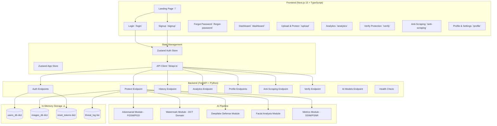
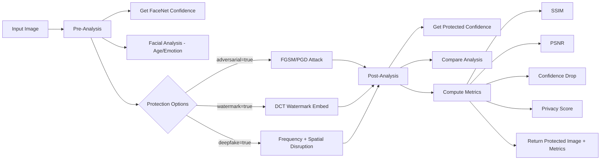
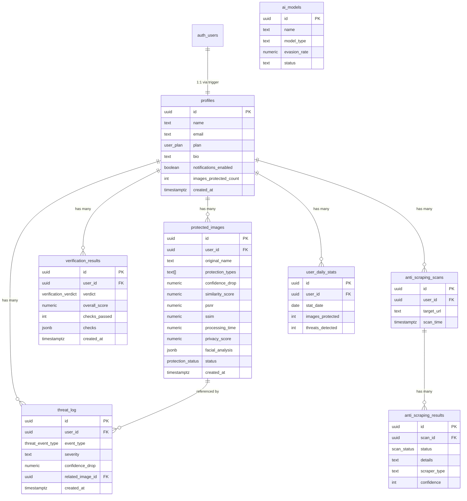

# AI Privacy Shield v2 — Complete Analysis, Supabase SQL & Master Prompt

---

## Part 1: Complete Project Flow Analysis

### 1.1 Architecture Overview



### 1.2 Data Entities (Currently In-Memory)

| Entity | Backend Variable | Fields | Used By |
|--------|-----------------|--------|---------|
| **Users** | `users_db` | id, name, email, password (hashed), plan, created_at | Auth, Profile, all authenticated endpoints |
| **Protected Images** | `images_db` | id, user_id, original_name, protection_types, confidence_drop, similarity_score, watermark_strength, psnr, ssim, processing_time, created_at, status | History, Analytics, Upload |
| **Reset Tokens** | `reset_tokens` | token → {email, expires} | Forgot/Reset password flow |
| **Threat Log** | `threat_log` | id, user_id, type, confidence_drop, timestamp | Analytics, Dashboard |

### 1.3 Frontend Pages & Their Data Dependencies

| Page | Route | Data Sources | Actions |
|------|-------|-------------|---------|
| **Landing** | `/` | None (static) | Navigate to login/signup |
| **Login** | `/login` | `POST /api/auth/login` | Authenticate user → store token |
| **Signup** | `/signup` | `POST /api/auth/signup` | Create user → store token |
| **Forgot Password** | `/forgot-password` | `POST /api/auth/forgot-password` | Request reset token |
| **Dashboard** | `/dashboard` | `GET /api/analytics` + `GET /api/history` | View stats, recent activity |
| **Upload/Protect** | `/upload` | `POST /api/protect` | Upload image → apply AI protections → download |
| **Analytics** | `/analytics` | `GET /api/analytics` | Charts: weekly activity, protection breakdown, privacy score |
| **Verify** | `/verify` | `POST /api/verify` | Upload image → check if protected |
| **Anti-Scraping** | `/anti-scraping` | `POST /api/anti-scraping/check` | Scan URL for scraping activity |
| **Profile** | `/profile` | `GET /api/profile`, `PUT /api/profile` | Edit name/email, change password, notifications, billing |

### 1.4 API Endpoints Summary

| Method | Path | Auth? | Rate Limit | Purpose |
|--------|------|-------|------------|---------|
| `POST` | `/api/auth/signup` | ❌ | 5/min | Create account |
| `POST` | `/api/auth/login` | ❌ | 10/min | Login |
| `POST` | `/api/auth/forgot-password` | ❌ | 3/min | Request password reset |
| `POST` | `/api/auth/reset-password` | ❌ | 5/min | Reset password with token |
| `POST` | `/api/protect` | ✅ | 30/min | Protect image with AI pipeline |
| `GET` | `/api/history` | ✅ | — | Get user's protected image history |
| `GET` | `/api/analytics` | ✅ | — | Get user's analytics/stats |
| `GET` | `/api/profile` | ✅ | — | Get user profile |
| `PUT` | `/api/profile` | ✅ | — | Update user profile |
| `POST` | `/api/anti-scraping/check` | ✅ | 10/min | Scan URL for scrapers |
| `GET` | `/api/ai/models` | ✅ | — | Get AI model info |
| `POST` | `/api/verify` | ✅ | 20/min | Verify if image is protected |
| `GET` | `/api/health` | ❌ | — | Health check |

### 1.5 AI Pipeline Flow



---

## Part 2: Complete Supabase SQL Schema

```sql
-- =====================================================================
-- AI PRIVACY SHIELD v2 — SUPABASE DATABASE SCHEMA
-- Complete production-ready SQL for Supabase (PostgreSQL + Auth + RLS)
-- =====================================================================

-- ─────────────────────────────────────────────────────────────────────
-- 1. EXTENSIONS
-- ─────────────────────────────────────────────────────────────────────
CREATE EXTENSION IF NOT EXISTS "uuid-ossp";
CREATE EXTENSION IF NOT EXISTS "pgcrypto";

-- ─────────────────────────────────────────────────────────────────────
-- 2. CUSTOM TYPES / ENUMS
-- ─────────────────────────────────────────────────────────────────────

-- User subscription plans
CREATE TYPE user_plan AS ENUM ('free', 'pro', 'enterprise');

-- Image protection status
CREATE TYPE protection_status AS ENUM ('processing', 'completed', 'failed');

-- Anti-scraping scan status
CREATE TYPE scan_status AS ENUM ('safe', 'warning', 'danger');

-- Threat log event types
CREATE TYPE threat_event_type AS ENUM (
    'image_protected',
    'scraping_detected',
    'deepfake_attempt',
    'unauthorized_access',
    'watermark_tampered'
);

-- Verification verdict
CREATE TYPE verification_verdict AS ENUM ('protected', 'partial', 'unprotected');

-- ─────────────────────────────────────────────────────────────────────
-- 3. PROFILES TABLE (extends Supabase auth.users)
-- ─────────────────────────────────────────────────────────────────────
CREATE TABLE public.profiles (
    id             UUID PRIMARY KEY REFERENCES auth.users(id) ON DELETE CASCADE,
    name           TEXT NOT NULL DEFAULT '',
    email          TEXT NOT NULL,
    avatar_url     TEXT,
    bio            TEXT DEFAULT 'Privacy-conscious digital professional',
    plan           user_plan NOT NULL DEFAULT 'free',
    language       TEXT NOT NULL DEFAULT 'en',

    -- Notification preferences
    notifications_enabled   BOOLEAN NOT NULL DEFAULT TRUE,
    weekly_report_enabled   BOOLEAN NOT NULL DEFAULT TRUE,
    threat_alerts_enabled   BOOLEAN NOT NULL DEFAULT TRUE,

    -- Usage tracking
    images_protected_count  INTEGER NOT NULL DEFAULT 0,
    scans_this_month        INTEGER NOT NULL DEFAULT 0,
    storage_used_mb         NUMERIC(10,2) NOT NULL DEFAULT 0,

    -- Timestamps
    created_at     TIMESTAMPTZ NOT NULL DEFAULT NOW(),
    updated_at     TIMESTAMPTZ NOT NULL DEFAULT NOW()
);

-- Index for email lookups
CREATE INDEX idx_profiles_email ON public.profiles(email);

-- Auto-update timestamp
CREATE OR REPLACE FUNCTION update_updated_at_column()
RETURNS TRIGGER AS $$
BEGIN
    NEW.updated_at = NOW();
    RETURN NEW;
END;
$$ LANGUAGE plpgsql;

CREATE TRIGGER trigger_profiles_updated_at
    BEFORE UPDATE ON public.profiles
    FOR EACH ROW
    EXECUTE FUNCTION update_updated_at_column();

-- ─────────────────────────────────────────────────────────────────────
-- 4. PROTECTED IMAGES TABLE
-- ─────────────────────────────────────────────────────────────────────
CREATE TABLE public.protected_images (
    id                  UUID PRIMARY KEY DEFAULT uuid_generate_v4(),
    user_id             UUID NOT NULL REFERENCES public.profiles(id) ON DELETE CASCADE,

    -- Image metadata
    original_name       TEXT NOT NULL,
    original_size_bytes BIGINT,
    protected_size_bytes BIGINT,
    mime_type           TEXT DEFAULT 'image/png',
    width               INTEGER,
    height              INTEGER,

    -- Storage paths (Supabase Storage)
    original_storage_path   TEXT,           -- path in 'originals' bucket
    protected_storage_path  TEXT,           -- path in 'protected' bucket

    -- Protection configuration
    protection_types    TEXT[] NOT NULL DEFAULT '{}',   -- ['adversarial','watermark','deepfake']
    strength            NUMERIC(3,2) NOT NULL DEFAULT 0.75,

    -- Protection metrics
    confidence_drop     NUMERIC(5,1) NOT NULL DEFAULT 0,
    similarity_score    NUMERIC(5,1) NOT NULL DEFAULT 0,
    watermark_strength  NUMERIC(5,1) NOT NULL DEFAULT 0,
    psnr                NUMERIC(6,2) NOT NULL DEFAULT 0,
    ssim                NUMERIC(6,4) NOT NULL DEFAULT 0,
    mse                 NUMERIC(10,4) NOT NULL DEFAULT 0,
    processing_time     NUMERIC(6,3) NOT NULL DEFAULT 0,

    -- Privacy score breakdown
    privacy_score           NUMERIC(5,1) DEFAULT 0,
    privacy_rating          TEXT DEFAULT 'Low',
    recognition_degradation NUMERIC(5,1) DEFAULT 0,
    prediction_variance     NUMERIC(5,1) DEFAULT 0,
    watermark_robustness    NUMERIC(5,1) DEFAULT 0,
    quality_penalty         NUMERIC(3,2) DEFAULT 1.0,

    -- Facial analysis (JSONB for flexibility)
    facial_analysis     JSONB,
    /*
      Structure:
      {
        "original": { "face_count": 1, "faces": [...], "full_image_analysis": {...} },
        "protected": { "face_count": 1, "faces": [...] },
        "comparison": {
            "face_detection_disrupted": false,
            "age_prediction_changed": true,
            "emotion_prediction_changed": true,
            "prediction_variance": 12.5
        }
      }
    */

    -- Status
    status              protection_status NOT NULL DEFAULT 'processing',
    error_message       TEXT,

    -- Timestamps
    created_at          TIMESTAMPTZ NOT NULL DEFAULT NOW(),
    updated_at          TIMESTAMPTZ NOT NULL DEFAULT NOW()
);

-- Indexes
CREATE INDEX idx_protected_images_user_id ON public.protected_images(user_id);
CREATE INDEX idx_protected_images_created_at ON public.protected_images(created_at DESC);
CREATE INDEX idx_protected_images_status ON public.protected_images(status);

-- Updated-at trigger
CREATE TRIGGER trigger_protected_images_updated_at
    BEFORE UPDATE ON public.protected_images
    FOR EACH ROW
    EXECUTE FUNCTION update_updated_at_column();

-- ─────────────────────────────────────────────────────────────────────
-- 5. IMAGE VERIFICATION RESULTS TABLE
-- ─────────────────────────────────────────────────────────────────────
CREATE TABLE public.verification_results (
    id                  UUID PRIMARY KEY DEFAULT uuid_generate_v4(),
    user_id             UUID NOT NULL REFERENCES public.profiles(id) ON DELETE CASCADE,

    -- Verdict
    verdict             verification_verdict NOT NULL DEFAULT 'unprotected',
    verdict_label       TEXT NOT NULL,
    summary             TEXT NOT NULL,
    overall_score       NUMERIC(5,1) NOT NULL DEFAULT 0,
    checks_passed       INTEGER NOT NULL DEFAULT 0,
    total_checks        INTEGER NOT NULL DEFAULT 3,

    -- Individual checks (JSONB for flexibility)
    checks              JSONB NOT NULL DEFAULT '{}',
    /*
      {
        "noise_analysis":  { "passed": true, "score": 85.2, "laplacian_std": 17.04, "description": "..." },
        "dct_watermark":   { "passed": true, "score": 72.1, "dct_variance_ratio": 0.36, "description": "..." },
        "fr_confidence":   { "passed": true, "score": 62.3, "raw_confidence": 37.7, "description": "..." }
      }
    */

    -- File info
    file_name           TEXT,
    file_size_bytes     BIGINT,

    -- Processing
    processing_time     NUMERIC(6,3) NOT NULL DEFAULT 0,

    -- Timestamps
    created_at          TIMESTAMPTZ NOT NULL DEFAULT NOW()
);

CREATE INDEX idx_verification_results_user_id ON public.verification_results(user_id);
CREATE INDEX idx_verification_results_created_at ON public.verification_results(created_at DESC);

-- ─────────────────────────────────────────────────────────────────────
-- 6. THREAT LOG TABLE
-- ─────────────────────────────────────────────────────────────────────
CREATE TABLE public.threat_log (
    id                  UUID PRIMARY KEY DEFAULT uuid_generate_v4(),
    user_id             UUID NOT NULL REFERENCES public.profiles(id) ON DELETE CASCADE,

    event_type          threat_event_type NOT NULL,
    severity            TEXT NOT NULL DEFAULT 'medium' CHECK (severity IN ('low', 'medium', 'high', 'critical')),

    -- Event details
    confidence_drop     NUMERIC(5,1),
    source_ip           INET,
    description         TEXT,
    metadata            JSONB DEFAULT '{}',

    -- Reference to related entities
    related_image_id    UUID REFERENCES public.protected_images(id) ON DELETE SET NULL,
    related_scan_id     UUID,  -- FK added after anti_scraping_scans table

    -- Timestamps
    created_at          TIMESTAMPTZ NOT NULL DEFAULT NOW()
);

CREATE INDEX idx_threat_log_user_id ON public.threat_log(user_id);
CREATE INDEX idx_threat_log_created_at ON public.threat_log(created_at DESC);
CREATE INDEX idx_threat_log_event_type ON public.threat_log(event_type);

-- ─────────────────────────────────────────────────────────────────────
-- 7. ANTI-SCRAPING SCANS TABLE
-- ─────────────────────────────────────────────────────────────────────
CREATE TABLE public.anti_scraping_scans (
    id                  UUID PRIMARY KEY DEFAULT uuid_generate_v4(),
    user_id             UUID NOT NULL REFERENCES public.profiles(id) ON DELETE CASCADE,

    -- Scan target
    target_url          TEXT NOT NULL,
    scan_time           TIMESTAMPTZ NOT NULL DEFAULT NOW(),

    -- Timestamps
    created_at          TIMESTAMPTZ NOT NULL DEFAULT NOW()
);

CREATE INDEX idx_anti_scraping_scans_user_id ON public.anti_scraping_scans(user_id);
CREATE INDEX idx_anti_scraping_scans_created_at ON public.anti_scraping_scans(created_at DESC);

-- ─────────────────────────────────────────────────────────────────────
-- 8. ANTI-SCRAPING SCAN RESULTS TABLE (child of scans)
-- ─────────────────────────────────────────────────────────────────────
CREATE TABLE public.anti_scraping_results (
    id                  UUID PRIMARY KEY DEFAULT uuid_generate_v4(),
    scan_id             UUID NOT NULL REFERENCES public.anti_scraping_scans(id) ON DELETE CASCADE,
    user_id             UUID NOT NULL REFERENCES public.profiles(id) ON DELETE CASCADE,

    -- Result
    url                 TEXT NOT NULL,
    status              scan_status NOT NULL DEFAULT 'safe',
    details             TEXT NOT NULL DEFAULT '',
    scraper_type        TEXT,
    confidence          INTEGER NOT NULL DEFAULT 0 CHECK (confidence >= 0 AND confidence <= 100),
    requests_per_hour   INTEGER DEFAULT 0,

    -- Timestamps
    created_at          TIMESTAMPTZ NOT NULL DEFAULT NOW()
);

CREATE INDEX idx_anti_scraping_results_scan_id ON public.anti_scraping_results(scan_id);

-- Add FK from threat_log to anti_scraping_scans
ALTER TABLE public.threat_log
    ADD CONSTRAINT fk_threat_log_scan
    FOREIGN KEY (related_scan_id)
    REFERENCES public.anti_scraping_scans(id)
    ON DELETE SET NULL;

-- ─────────────────────────────────────────────────────────────────────
-- 9. AI MODELS REGISTRY TABLE
-- ─────────────────────────────────────────────────────────────────────
CREATE TABLE public.ai_models (
    id                  UUID PRIMARY KEY DEFAULT uuid_generate_v4(),
    name                TEXT NOT NULL,
    model_type          TEXT NOT NULL,    -- 'adversarial_perturbation', 'invisible_watermark', 'deepfake_immunization'

    -- Performance metrics
    evasion_rate        NUMERIC(5,2),
    strength_score      NUMERIC(5,2),
    resistance_rate     NUMERIC(5,2),

    -- Status
    status              TEXT NOT NULL DEFAULT 'active' CHECK (status IN ('active', 'inactive', 'training')),
    last_updated        DATE NOT NULL DEFAULT CURRENT_DATE,

    -- Metadata
    version             TEXT NOT NULL DEFAULT '1.0.0',
    description         TEXT,

    -- Timestamps
    created_at          TIMESTAMPTZ NOT NULL DEFAULT NOW(),
    updated_at          TIMESTAMPTZ NOT NULL DEFAULT NOW()
);

CREATE TRIGGER trigger_ai_models_updated_at
    BEFORE UPDATE ON public.ai_models
    FOR EACH ROW
    EXECUTE FUNCTION update_updated_at_column();

-- ─────────────────────────────────────────────────────────────────────
-- 10. USER ANALYTICS / DAILY STATS TABLE
-- ─────────────────────────────────────────────────────────────────────
CREATE TABLE public.user_daily_stats (
    id                  UUID PRIMARY KEY DEFAULT uuid_generate_v4(),
    user_id             UUID NOT NULL REFERENCES public.profiles(id) ON DELETE CASCADE,
    stat_date           DATE NOT NULL DEFAULT CURRENT_DATE,

    images_protected    INTEGER NOT NULL DEFAULT 0,
    threats_detected    INTEGER NOT NULL DEFAULT 0,
    scans_performed     INTEGER NOT NULL DEFAULT 0,
    verifications_done  INTEGER NOT NULL DEFAULT 0,

    -- Aggregate metrics for the day
    avg_confidence_drop NUMERIC(5,1) DEFAULT 0,
    avg_ssim            NUMERIC(6,4) DEFAULT 0,
    avg_psnr            NUMERIC(6,2) DEFAULT 0,

    -- Timestamps
    created_at          TIMESTAMPTZ NOT NULL DEFAULT NOW(),
    updated_at          TIMESTAMPTZ NOT NULL DEFAULT NOW(),

    UNIQUE(user_id, stat_date)
);

CREATE INDEX idx_user_daily_stats_user_date ON public.user_daily_stats(user_id, stat_date DESC);

CREATE TRIGGER trigger_user_daily_stats_updated_at
    BEFORE UPDATE ON public.user_daily_stats
    FOR EACH ROW
    EXECUTE FUNCTION update_updated_at_column();

-- ─────────────────────────────────────────────────────────────────────
-- 11. SEED DATA — AI MODELS
-- ─────────────────────────────────────────────────────────────────────
INSERT INTO public.ai_models (name, model_type, evasion_rate, strength_score, resistance_rate, status, last_updated, version) VALUES
    ('AdversarialNet v3.1', 'adversarial_perturbation', 99.2, NULL, NULL, 'active', '2026-03-28', '3.1.0'),
    ('WatermarkDCT v2.0', 'invisible_watermark', NULL, 97.3, NULL, 'active', '2026-03-20', '2.0.0'),
    ('DeepfakeGuard v4.2', 'deepfake_immunization', NULL, NULL, 96.1, 'active', '2026-03-30', '4.2.0');

-- ─────────────────────────────────────────────────────────────────────
-- 12. FUNCTIONS — Auto-create profile on signup
-- ─────────────────────────────────────────────────────────────────────
CREATE OR REPLACE FUNCTION public.handle_new_user()
RETURNS TRIGGER AS $$
BEGIN
    INSERT INTO public.profiles (id, name, email)
    VALUES (
        NEW.id,
        COALESCE(NEW.raw_user_meta_data ->> 'name', ''),
        COALESCE(NEW.email, '')
    );
    RETURN NEW;
END;
$$ LANGUAGE plpgsql SECURITY DEFINER;

CREATE TRIGGER on_auth_user_created
    AFTER INSERT ON auth.users
    FOR EACH ROW
    EXECUTE FUNCTION public.handle_new_user();

-- ─────────────────────────────────────────────────────────────────────
-- 13. FUNCTIONS — Increment user image count
-- ─────────────────────────────────────────────────────────────────────
CREATE OR REPLACE FUNCTION public.increment_image_count()
RETURNS TRIGGER AS $$
BEGIN
    IF NEW.status = 'completed' AND (OLD IS NULL OR OLD.status != 'completed') THEN
        UPDATE public.profiles
        SET images_protected_count = images_protected_count + 1
        WHERE id = NEW.user_id;

        -- Upsert daily stats
        INSERT INTO public.user_daily_stats (user_id, stat_date, images_protected)
        VALUES (NEW.user_id, CURRENT_DATE, 1)
        ON CONFLICT (user_id, stat_date)
        DO UPDATE SET
            images_protected = public.user_daily_stats.images_protected + 1,
            updated_at = NOW();
    END IF;
    RETURN NEW;
END;
$$ LANGUAGE plpgsql SECURITY DEFINER;

CREATE TRIGGER trigger_increment_image_count
    AFTER INSERT OR UPDATE ON public.protected_images
    FOR EACH ROW
    EXECUTE FUNCTION public.increment_image_count();

-- ─────────────────────────────────────────────────────────────────────
-- 14. FUNCTIONS — Analytics aggregation view
-- ─────────────────────────────────────────────────────────────────────
CREATE OR REPLACE FUNCTION public.get_user_analytics(p_user_id UUID)
RETURNS JSON AS $$
DECLARE
    result JSON;
BEGIN
    SELECT json_build_object(
        'total_protected', COALESCE(COUNT(*), 0),
        'avg_confidence_drop', COALESCE(ROUND(AVG(confidence_drop)::numeric, 1), 0),
        'avg_similarity_score', COALESCE(ROUND(AVG(similarity_score)::numeric, 1), 0),
        'avg_psnr', COALESCE(ROUND(AVG(psnr)::numeric, 2), 0),
        'avg_ssim', COALESCE(ROUND(AVG(ssim)::numeric, 4), 0),
        'threats_detected', COALESCE(COUNT(*) * 6, 0),
        'privacy_score', LEAST(100, 70 + COALESCE(COUNT(*), 0) * 2),
        'protection_breakdown', (
            SELECT json_build_object(
                'adversarial', COUNT(*) FILTER (WHERE 'adversarial' = ANY(protection_types)),
                'watermark',   COUNT(*) FILTER (WHERE 'watermark' = ANY(protection_types)),
                'deepfake',    COUNT(*) FILTER (WHERE 'deepfake' = ANY(protection_types))
            )
            FROM public.protected_images
            WHERE user_id = p_user_id AND status = 'completed'
        )
    ) INTO result
    FROM public.protected_images
    WHERE user_id = p_user_id AND status = 'completed';

    RETURN result;
END;
$$ LANGUAGE plpgsql SECURITY DEFINER;

-- ─────────────────────────────────────────────────────────────────────
-- 15. FUNCTIONS — Weekly activity data
-- ─────────────────────────────────────────────────────────────────────
CREATE OR REPLACE FUNCTION public.get_weekly_activity(p_user_id UUID, p_days INTEGER DEFAULT 7)
RETURNS JSON AS $$
DECLARE
    result JSON;
BEGIN
    SELECT json_agg(
        json_build_object(
            'name', TO_CHAR(d.day, 'Dy'),
            'date', d.day,
            'protected', COALESCE(s.images_protected, 0),
            'threats', COALESCE(s.threats_detected, 0)
        ) ORDER BY d.day
    ) INTO result
    FROM generate_series(
        CURRENT_DATE - (p_days - 1),
        CURRENT_DATE,
        '1 day'::INTERVAL
    ) AS d(day)
    LEFT JOIN public.user_daily_stats s
        ON s.user_id = p_user_id AND s.stat_date = d.day;

    RETURN COALESCE(result, '[]'::JSON);
END;
$$ LANGUAGE plpgsql SECURITY DEFINER;

-- ─────────────────────────────────────────────────────────────────────
-- 16. ROW LEVEL SECURITY (RLS) POLICIES
-- ─────────────────────────────────────────────────────────────────────

-- Enable RLS on all tables
ALTER TABLE public.profiles ENABLE ROW LEVEL SECURITY;
ALTER TABLE public.protected_images ENABLE ROW LEVEL SECURITY;
ALTER TABLE public.verification_results ENABLE ROW LEVEL SECURITY;
ALTER TABLE public.threat_log ENABLE ROW LEVEL SECURITY;
ALTER TABLE public.anti_scraping_scans ENABLE ROW LEVEL SECURITY;
ALTER TABLE public.anti_scraping_results ENABLE ROW LEVEL SECURITY;
ALTER TABLE public.ai_models ENABLE ROW LEVEL SECURITY;
ALTER TABLE public.user_daily_stats ENABLE ROW LEVEL SECURITY;

-- ── PROFILES ──
CREATE POLICY "Users can view own profile"
    ON public.profiles FOR SELECT
    USING (auth.uid() = id);

CREATE POLICY "Users can update own profile"
    ON public.profiles FOR UPDATE
    USING (auth.uid() = id)
    WITH CHECK (auth.uid() = id);

-- ── PROTECTED IMAGES ──
CREATE POLICY "Users can view own images"
    ON public.protected_images FOR SELECT
    USING (auth.uid() = user_id);

CREATE POLICY "Users can insert own images"
    ON public.protected_images FOR INSERT
    WITH CHECK (auth.uid() = user_id);

CREATE POLICY "Users can update own images"
    ON public.protected_images FOR UPDATE
    USING (auth.uid() = user_id)
    WITH CHECK (auth.uid() = user_id);

CREATE POLICY "Users can delete own images"
    ON public.protected_images FOR DELETE
    USING (auth.uid() = user_id);

-- ── VERIFICATION RESULTS ──
CREATE POLICY "Users can view own verifications"
    ON public.verification_results FOR SELECT
    USING (auth.uid() = user_id);

CREATE POLICY "Users can insert own verifications"
    ON public.verification_results FOR INSERT
    WITH CHECK (auth.uid() = user_id);

-- ── THREAT LOG ──
CREATE POLICY "Users can view own threats"
    ON public.threat_log FOR SELECT
    USING (auth.uid() = user_id);

CREATE POLICY "Users can insert own threats"
    ON public.threat_log FOR INSERT
    WITH CHECK (auth.uid() = user_id);

-- ── ANTI-SCRAPING SCANS ──
CREATE POLICY "Users can view own scans"
    ON public.anti_scraping_scans FOR SELECT
    USING (auth.uid() = user_id);

CREATE POLICY "Users can insert own scans"
    ON public.anti_scraping_scans FOR INSERT
    WITH CHECK (auth.uid() = user_id);

-- ── ANTI-SCRAPING RESULTS ──
CREATE POLICY "Users can view own scan results"
    ON public.anti_scraping_results FOR SELECT
    USING (auth.uid() = user_id);

CREATE POLICY "Users can insert own scan results"
    ON public.anti_scraping_results FOR INSERT
    WITH CHECK (auth.uid() = user_id);

-- ── AI MODELS (public read) ──
CREATE POLICY "Anyone can view AI models"
    ON public.ai_models FOR SELECT
    USING (TRUE);

-- ── DAILY STATS ──
CREATE POLICY "Users can view own stats"
    ON public.user_daily_stats FOR SELECT
    USING (auth.uid() = user_id);

CREATE POLICY "Service role can manage stats"
    ON public.user_daily_stats FOR ALL
    USING (auth.uid() = user_id);

-- ─────────────────────────────────────────────────────────────────────
-- 17. STORAGE BUCKETS
-- ─────────────────────────────────────────────────────────────────────

-- Create storage buckets (run in Supabase Dashboard or via management API)
-- Bucket: 'originals'  — stores original uploaded images (private)
-- Bucket: 'protected'  — stores AI-protected images (private)
-- Bucket: 'avatars'    — stores user profile avatars (public)

INSERT INTO storage.buckets (id, name, public, file_size_limit, allowed_mime_types)
VALUES
    ('originals', 'originals', FALSE, 15728640, ARRAY['image/png','image/jpeg','image/webp']),
    ('protected', 'protected', FALSE, 15728640, ARRAY['image/png','image/jpeg','image/webp']),
    ('avatars',   'avatars',   TRUE,  2097152,  ARRAY['image/png','image/jpeg','image/webp']);

-- Storage RLS policies
CREATE POLICY "Users can upload originals"
    ON storage.objects FOR INSERT
    WITH CHECK (bucket_id = 'originals' AND auth.uid()::text = (storage.foldername(name))[1]);

CREATE POLICY "Users can view own originals"
    ON storage.objects FOR SELECT
    USING (bucket_id = 'originals' AND auth.uid()::text = (storage.foldername(name))[1]);

CREATE POLICY "Users can upload protected images"
    ON storage.objects FOR INSERT
    WITH CHECK (bucket_id = 'protected' AND auth.uid()::text = (storage.foldername(name))[1]);

CREATE POLICY "Users can view own protected images"
    ON storage.objects FOR SELECT
    USING (bucket_id = 'protected' AND auth.uid()::text = (storage.foldername(name))[1]);

CREATE POLICY "Users can upload avatars"
    ON storage.objects FOR INSERT
    WITH CHECK (bucket_id = 'avatars' AND auth.uid()::text = (storage.foldername(name))[1]);

CREATE POLICY "Anyone can view avatars"
    ON storage.objects FOR SELECT
    USING (bucket_id = 'avatars');

CREATE POLICY "Users can update own avatars"
    ON storage.objects FOR UPDATE
    USING (bucket_id = 'avatars' AND auth.uid()::text = (storage.foldername(name))[1]);

-- ─────────────────────────────────────────────────────────────────────
-- 18. VIEWS — For common queries
-- ─────────────────────────────────────────────────────────────────────

-- User dashboard summary view
CREATE OR REPLACE VIEW public.v_user_dashboard AS
SELECT
    p.id AS user_id,
    p.name,
    p.plan,
    p.images_protected_count,
    COALESCE(AVG(pi.confidence_drop), 0)::NUMERIC(5,1) AS avg_confidence_drop,
    COALESCE(AVG(pi.similarity_score), 0)::NUMERIC(5,1) AS avg_similarity_score,
    COALESCE(AVG(pi.psnr), 0)::NUMERIC(6,2) AS avg_psnr,
    COALESCE(AVG(pi.ssim), 0)::NUMERIC(6,4) AS avg_ssim,
    COUNT(pi.id)::INTEGER AS total_images,
    (COUNT(tl.id))::INTEGER AS total_threats
FROM public.profiles p
LEFT JOIN public.protected_images pi ON pi.user_id = p.id AND pi.status = 'completed'
LEFT JOIN public.threat_log tl ON tl.user_id = p.id
GROUP BY p.id, p.name, p.plan, p.images_protected_count;
```

---

## Part 3: Master Prompt — Connecting Frontend to Supabase

> [!IMPORTANT]
> Use this master prompt when instructing an AI assistant or your team to integrate the frontend with Supabase. It covers every connection point.

---

### MASTER INTEGRATION PROMPT

```
You are connecting the AI Privacy Shield v2 Next.js frontend to a Supabase backend.
The project currently uses a Python FastAPI backend with in-memory dictionaries.
We are migrating to Supabase (PostgreSQL + Auth + Storage + Edge Functions).

══════════════════════════════════════════════════════════════
SUPABASE PROJECT CONFIG
══════════════════════════════════════════════════════════════
- Supabase URL:       <YOUR_SUPABASE_URL>
- Supabase Anon Key:  <YOUR_SUPABASE_ANON_KEY>
- Set these in frontend/.env.local:
    NEXT_PUBLIC_SUPABASE_URL=<YOUR_SUPABASE_URL>
    NEXT_PUBLIC_SUPABASE_ANON_KEY=<YOUR_SUPABASE_ANON_KEY>

══════════════════════════════════════════════════════════════
STEP 1: INSTALL DEPENDENCIES
══════════════════════════════════════════════════════════════
cd frontend
npm install @supabase/supabase-js @supabase/ssr

══════════════════════════════════════════════════════════════
STEP 2: SUPABASE CLIENT SETUP
══════════════════════════════════════════════════════════════
Create `frontend/src/lib/supabase.ts`:

```typescript
import { createBrowserClient } from '@supabase/ssr'

export const supabase = createBrowserClient(
  process.env.NEXT_PUBLIC_SUPABASE_URL!,
  process.env.NEXT_PUBLIC_SUPABASE_ANON_KEY!
)
```

══════════════════════════════════════════════════════════════
STEP 3: REPLACE AUTH (Zustand store → Supabase Auth)
══════════════════════════════════════════════════════════════
Modify `frontend/src/lib/store.ts`:

- REMOVE: Direct fetch calls to /api/auth/login and /api/auth/signup
- REPLACE with Supabase Auth methods:

  signup:
    const { data, error } = await supabase.auth.signUp({
      email, password,
      options: { data: { name } }
    })

  login:
    const { data, error } = await supabase.auth.signInWithPassword({
      email, password
    })

  logout:
    await supabase.auth.signOut()

  session listener (add to root layout or auth provider):
    supabase.auth.onAuthStateChange((event, session) => { ... })

- The profile row is auto-created via the `handle_new_user` trigger
- Remove the localStorage-based token management
- Supabase handles JWT tokens automatically via cookies/localStorage

══════════════════════════════════════════════════════════════
STEP 4: REPLACE API CLIENT (lib/api.ts → Supabase queries)
══════════════════════════════════════════════════════════════
Replace each method in `frontend/src/lib/api.ts`:

┌─────────────────────────┬──────────────────────────────────────────────┐
│ OLD METHOD              │ NEW SUPABASE IMPLEMENTATION                 │
├─────────────────────────┼──────────────────────────────────────────────┤
│ api.getProfile()        │ supabase                                    │
│                         │   .from('profiles')                         │
│                         │   .select('*')                              │
│                         │   .eq('id', userId)                         │
│                         │   .single()                                 │
├─────────────────────────┼──────────────────────────────────────────────┤
│ api.updateProfile(data) │ supabase                                    │
│                         │   .from('profiles')                         │
│                         │   .update({ name, email })                  │
│                         │   .eq('id', userId)                         │
├─────────────────────────┼──────────────────────────────────────────────┤
│ api.getHistory()        │ supabase                                    │
│                         │   .from('protected_images')                 │
│                         │   .select('*')                              │
│                         │   .eq('user_id', userId)                    │
│                         │   .order('created_at', { ascending: false })│
│                         │   .limit(20)                                │
├─────────────────────────┼──────────────────────────────────────────────┤
│ api.getAnalytics()      │ supabase                                    │
│                         │   .rpc('get_user_analytics',                │
│                         │        { p_user_id: userId })               │
│                         │                                             │
│                         │ + supabase                                  │
│                         │   .rpc('get_weekly_activity',               │
│                         │        { p_user_id: userId, p_days: 7 })   │
├─────────────────────────┼──────────────────────────────────────────────┤
│ api.protectImage(file,  │ 1. Upload original to Storage:              │
│   options)              │    supabase.storage                         │
│                         │      .from('originals')                     │
│                         │      .upload(path, file)                    │
│                         │                                             │
│                         │ 2. Call Edge Function (AI pipeline):        │
│                         │    supabase.functions.invoke(               │
│                         │      'protect-image', {                     │
│                         │       body: formData                        │
│                         │    })                                       │
│                         │                                             │
│                         │ 3. Edge Function:                           │
│                         │    - Downloads original from Storage        │
│                         │    - Runs Python AI pipeline (or calls      │
│                         │      external API)                          │
│                         │    - Uploads protected image to Storage     │
│                         │    - Inserts row in protected_images table  │
│                         │    - Inserts threat_log entry               │
│                         │    - Returns result JSON                    │
├─────────────────────────┼──────────────────────────────────────────────┤
│ api.verifyImage(file)   │ Call Edge Function:                         │
│                         │    supabase.functions.invoke(               │
│                         │      'verify-image', {                      │
│                         │       body: formData                        │
│                         │    })                                       │
│                         │                                             │
│                         │ Edge Function runs verification checks,     │
│                         │ inserts into verification_results table,    │
│                         │ returns verdict JSON.                       │
├─────────────────────────┼──────────────────────────────────────────────┤
│ api.checkAntiScraping   │ 1. Call Edge Function:                      │
│   (url)                 │    supabase.functions.invoke(               │
│                         │      'anti-scraping-check', {               │
│                         │       body: { url }                         │
│                         │    })                                       │
│                         │                                             │
│                         │ 2. Edge Function:                           │
│                         │    - Performs scraping analysis              │
│                         │    - Inserts scan + results rows            │
│                         │    - Returns results                        │
│                         │                                             │
│                         │ OR (for scan history):                      │
│                         │    supabase                                 │
│                         │      .from('anti_scraping_scans')           │
│                         │      .select('*, anti_scraping_results(*)') │
│                         │      .eq('user_id', userId)                 │
│                         │      .order('created_at', {ascending:false})│
├─────────────────────────┼──────────────────────────────────────────────┤
│ api.forgotPassword      │ supabase.auth.resetPasswordForEmail(email,  │
│   (email)               │   { redirectTo: '<URL>/reset-password' })   │
├─────────────────────────┼──────────────────────────────────────────────┤
│ api.resetPassword       │ supabase.auth.updateUser({                  │
│   (token, password)     │   password: newPassword                     │
│                         │ })                                          │
│                         │ (Called after user follows reset link)       │
└─────────────────────────┴──────────────────────────────────────────────┘

══════════════════════════════════════════════════════════════
STEP 5: EDGE FUNCTIONS (for AI pipeline)
══════════════════════════════════════════════════════════════
The AI pipeline (adversarial, watermark, deepfake defense) runs
Python + PyTorch + FaceNet. Supabase Edge Functions run Deno/TypeScript.

Options for the AI pipeline:
  A) Deploy FastAPI backend separately (Render/Railway/Cloud Run)
     and call it from Edge Functions as an internal API.
  B) Use Edge Functions as a thin proxy that:
     - Receives the upload
     - Stores the file in Supabase Storage
     - Calls the deployed Python backend API
     - Stores results in the database
     - Returns the response to the frontend

Recommended: Option B (hybrid architecture)

Edge Function: `protect-image`
  - Receives: multipart form (file + options)
  - Calls: Python backend POST /api/protect
  - Saves: protected image to Storage bucket
  - Inserts: row into protected_images table
  - Inserts: row into threat_log table
  - Returns: protection result JSON

Edge Function: `verify-image`
  - Receives: multipart form (file)
  - Calls: Python backend POST /api/verify
  - Inserts: row into verification_results table
  - Returns: verification result JSON

Edge Function: `anti-scraping-check`
  - Receives: { url }
  - Calls: Python backend POST /api/anti-scraping/check
  - Inserts: scan + results rows
  - Returns: results JSON

══════════════════════════════════════════════════════════════
STEP 6: DATABASE TABLE ↔ FRONTEND PAGE MAPPING
══════════════════════════════════════════════════════════════
┌─────────────────────┬────────────────────────────────────┐
│ Frontend Page       │ Supabase Tables Used               │
├─────────────────────┼────────────────────────────────────┤
│ /login, /signup     │ auth.users + profiles (auto)       │
│ /forgot-password    │ auth (built-in reset flow)         │
│ /dashboard          │ profiles, protected_images,        │
│                     │ user_daily_stats, threat_log       │
│ /upload             │ protected_images, threat_log,      │
│                     │ Storage: originals, protected      │
│ /analytics          │ protected_images (via RPC),        │
│                     │ user_daily_stats                   │
│ /verify             │ verification_results               │
│ /anti-scraping      │ anti_scraping_scans,               │
│                     │ anti_scraping_results              │
│ /profile            │ profiles                           │
│ AI Models page      │ ai_models                          │
└─────────────────────┴────────────────────────────────────┘

══════════════════════════════════════════════════════════════
STEP 7: ENVIRONMENT VARIABLES
══════════════════════════════════════════════════════════════

frontend/.env.local:
  NEXT_PUBLIC_SUPABASE_URL=https://xxxx.supabase.co
  NEXT_PUBLIC_SUPABASE_ANON_KEY=eyJhbGci...
  NEXT_PUBLIC_AI_BACKEND_URL=https://your-python-api.render.com

backend/.env (Python FastAPI — deployed separately):
  SUPABASE_URL=https://xxxx.supabase.co
  SUPABASE_SERVICE_ROLE_KEY=eyJhbGci...
  SECRET_KEY=your-secret-key

══════════════════════════════════════════════════════════════
STEP 8: REMOVE LEGACY CODE
══════════════════════════════════════════════════════════════
After full integration, remove from backend/main.py:
  - users_db, images_db, reset_tokens, threat_log (in-memory dicts)
  - Custom JWT auth (use Supabase auth)
  - Demo user seeding (use Supabase Dashboard or seed SQL)
  - The Python backend remains ONLY for the AI pipeline endpoints

══════════════════════════════════════════════════════════════
IMPORTANT NOTES
══════════════════════════════════════════════════════════════
1. Supabase Auth handles signup, login, password reset, JWT tokens
2. RLS (Row Level Security) ensures users only see their own data
3. Storage buckets use folder-based access: {user_id}/filename.png
4. Edge Functions bridge the frontend ↔ Python AI backend
5. The Python FastAPI backend is deployed separately and handles
   ONLY the compute-intensive AI pipeline (protect, verify, models)
6. All data persistence goes through Supabase PostgreSQL
7. Real-time subscriptions can be added later for live threat feed
```

---

## Entity Relationship Diagram


